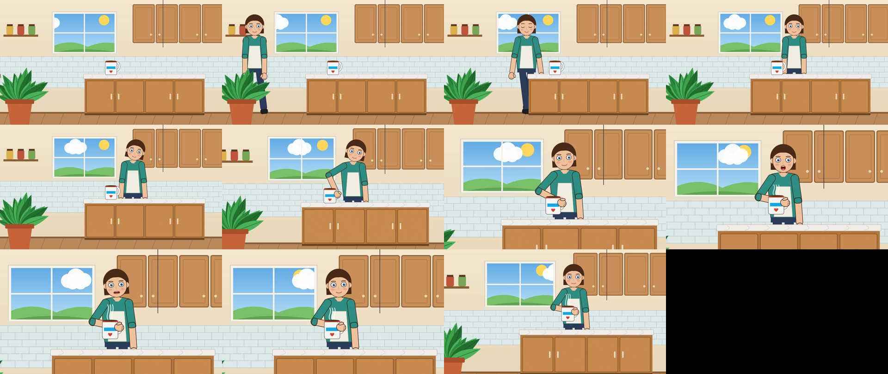
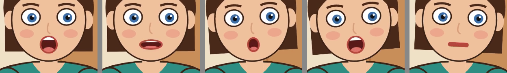
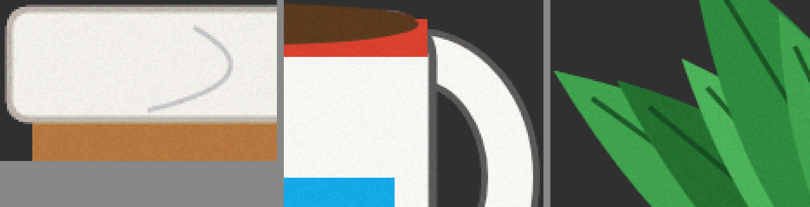
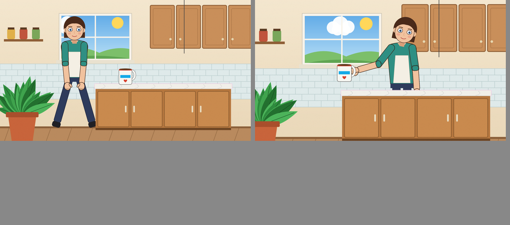
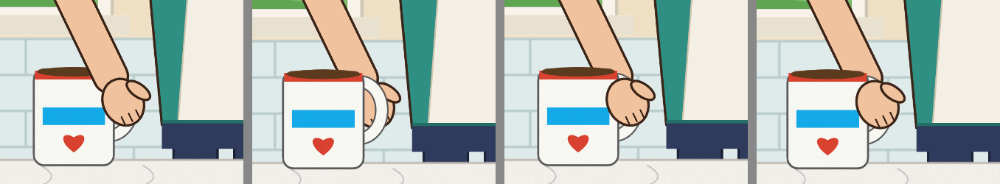
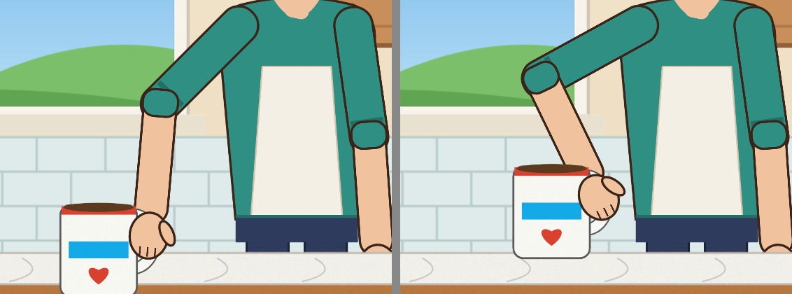

# Phase 1 report: deterministic layered 2D engine

**Result.** The engine renders the kitchen test scene end to end:

- **Source assets:** 25 synthetic originals, processed non-destructively (3 colour-keyed, 20 with native alpha). The 2 opaque plates (kitchen background, window view) are used as-is.
- **Scene:** 24 layers and 22 animation tracks over 330 frames (11 s at 30 fps).
- **Video:** `examples/kitchen/out/kitchen.mp4`, 1920×1080, H.264 with AAC audio.

I inspected the video by decoding frames back out of the MP4, not by looking at previews. The
problems I found were either fixed or are listed below.

## 1. Deliverables

| # | Deliverable | Where |
|---|---|---|
| 1 | Engine source | `src/` |
| 2 | Scene JSON schema | `src/scene/schema.ts` (Zod), `schema/scene.schema.json` (generated JSON Schema) |
| 3 | Renderer abstraction | `src/render/renderer.ts` (`Renderer`, backend-agnostic `DisplayList` in `src/engine/displayList.ts`) |
| 4 | Skia renderer | `src/render/skia.ts` |
| 5 | Timeline / keyframes | `src/timeline/{evaluate,easing}.ts` |
| 6 | Global z independent of hierarchy | `renderOrder()` in `src/engine/transform.ts` |
| 7 | Camera | `cameraMatrix()` in `src/engine/transform.ts` |
| 8 | Pivot / anchor | `localMatrixOf()` / `resolveFrame()` in `src/engine/transform.ts` |
| 9–14 | Asset pipeline: border detection, flood fill, despill, trim, components | `src/assets/{background,removal,trim,components,pipeline}.ts` |
| 15 | `measure_layout` | `src/engine/layout.ts`; outputs in `examples/kitchen/out/layout/` |
| 16 | Example scene | `examples/kitchen/scene.json` (built by `build-scene.ts`, then corrected by `feedback-loop.ts`); `scene.before-feedback.json` is the version before correction |
| 17 | Asset-generation prompts | `examples/kitchen/PROMPTS.md` |
| 18 | Original test assets | `examples/kitchen/assets/originals/` (+ `manifest.json`, `assets/audio/voice.wav`) |
| 19 | Processed assets | `examples/kitchen/assets/processed/<name>/` (original copy, mask, untrimmed, trimmed, metadata) + `summary.json` |
| 20 | Normal previews | `examples/kitchen/out/previews/` |
| 21 | Debug previews | `examples/kitchen/out/debug/` |
| 22 | Final MP4 | `examples/kitchen/out/kitchen.mp4` |
| 23 | Automated tests | `tests/` (70 tests: `npm test`) |
| 24 | README | `README.md` |
| 25 | Limitations | §5 below |

Run everything with `npm run example:all`, then `npx tsx examples/kitchen/report-images.ts` for
the images in this report.

## 2. What the test video shows

| Frames | Action | Features exercised |
|---|---|---|
| 0–100 | Character walks in from off-screen behind the foreground plant and stops behind the counter | parent movement (`character.x`, linear then ease-out), body bob (`y`, ease-in-out), leg/arm swing rotations around hip/shoulder pivots, plant `z=50` in front, counter hides the legs |
| 60–64, 246–250 | Blink | `eyes.asset` step keyframes |
| 100–155 | Head tilts toward the cup around the neck; right arm reaches over the counter | head pivot rotation; shoulder → elbow → wrist chain; `right_forearm.z` switches 14 → 30 (step) so the forearm passes in front of the counter while the torso stays behind it |
| 155 | Cup hand-off | `cup_on_counter.visible` → false and `cup_in_hand.visible` → true on the same frame (step); the held cup is attached with `parentPoint: "grip"` and pivots on its `handle` attachment point |
| 155–195 | Lift; the cup stays upright | cup rotation keyframes cancel the arm's accumulated rotation |
| 130–200, 285–320 | Camera push-in (zoom 1 → 1.35, pan) and pull-out | camera keyframes; ease-in-out and cubic-bezier |
| 195–315 | Steam | opacity fade-in, `scaleY` animation |
| 210–290 | Talking | `mouth.asset` step keyframes synced to syllables in `voice.wav` (audio muxed; −12 dB peak during speech, silent before) |
| all | Cloud drifts past the window | rect mask (sky) and layer mask (cloud) |
| 312–329 | Fade to black | opacity on a `fill` layer at `z=100` |

## 3. Problems found during inspection, and fixes

### 3.1 Engine / pipeline code bugs

| Problem found | How it was found | Fix | Regression test |
|---|---|---|---|
| **Blue specks on thin outlines after despill.** Edge pixels of the cup's 4 px grey outline chose an equally contaminated neighbour as their "foreground" colour and stayed blue-tinted at full alpha. | 5× zoom of the processed cup over a dark background | Foreground reference selection now prefers the purest candidate among those that explain the pixel, plus a fallback along the key's chroma axis for 3-colour edges | `thin outline edges on blue do not keep blue specks` |
| **Pink fringe on the counter's top edge.** Solid grey outline pixels (187,179,170) beside a white fill on a green key were read as "67 % white + 33 % green", and un-mixing turned them pink. | Visible in the first MP4 at 1:1 | Candidates must lie on the B–F segment within a residual bound (default tightened 0.25 → 0.1); least residual wins, and "farthest from the key" only breaks ties | `solid grey outline next to white fill is not mistaken for a mix` |
| CLI `preview` wrote files relative to the scene directory instead of the shell's current directory | First CLI run | CLI resolves its own output args against the current directory; tool-API paths stay scene-relative (documented) | — |

Findings about the test assets, not the engine. The pipeline behaved correctly in both cases:
* The first plant drawing touched the left and right image edges, which violates the contract. The generator was fixed.
* The synthetic cup drawing had a 1–2 px gap between the handle and its outline, so real key-colour pixels were enclosed *inside* the subject. Edge-connected removal correctly kept them, since they are not connected to the border. The drawing was fixed.

Cup pipeline stages (original with a stray speck, background mask, untrimmed result, trimmed
result). The enclosed stripe in the key colour survives. The handle hole was removed by id, and so
was the speck (component 2):

### 3.2 Layout / animation problems fixed by editing scene data only

No renderer source was changed for any of these. The first previews (frames 50 and 155) show the
splayed walk and a reach that stops well above the counter:

| Problem found | Fix (data only) |
|---|---|
| Walk cycle: ±16° leg swing splayed the legs in the front view | leg rotation keyframes ±7° |
| **Hand-off mismatch:** at frame 155 the held cup's base was at (747, 581) while the waiting cup's base was at (960, 648). The cup "teleported" 213 px. | `feedback-loop.ts` (below) |
| First solve put the elbow across the chest (the other IK branch) | re-seeded the reach pose (`upper 45°, fore −40°`) and re-ran the loop |
| **Layering pop at the hand-off:** the waiting cup (z 21) drew behind the hand, the held cup (z 32) in front of it | both cups `z: 30.5`, between the forearm (30) and the hand (31) |
| Steam covered the mouth while talking | lift pose `upper 34°, fore −112°` |

Hand-off layering, frames 154 | 155 with the old z values, then 154 | 155 fixed:

**Feedback loop (`examples/kitchen/feedback-loop.ts`).** The script drives the scene exclusively
through the agent tool API:

`render_preview` / `render_debug_preview` → `measure_layout` (the held cup's `base_center`
attachment point, the counter's `top_left`) → `update_keyframe` (two rotation values plus the cup's
counter-rotation) → `measure_layout` … → `update_layer` (waiting cup `x/y`) → `render_preview` →
`save_scene`.

A two-variable Newton iteration stands in for the agent's reasoning. It converged in 4 steps, from
an error of (−69, +51) px to (0.02, −0.01) px, and the log is in `out/feedback-loop/log.json`.

## 4. `measure_layout` across frames

These values come from `out/layout/summary.json` (full per-frame dumps sit next to it). World
geometry changes with parent movement and child rotation. Screen geometry additionally reflects the
camera:

| frame | camera | `character` pivot (world) | `right_forearm` world rotation | `right_hand.grip` (world) | cup visible | `cup_in_hand` screen bounds |
|---|---|---|---|---|---|---|
| 0 | x=0 y=0 s=1 | (−150, 990) | 8.2° | (−280.9, 664.8) | false | [−420.2, 556.4, −238, 736.5] |
| 50 | x=0 y=0 s=1 | (570.2, 990) | −0.2° | (487.1, 669.7) | false | [348.7, 572.5, 524.7, 744.7] |
| 100 | x=0 y=0 s=1 | (1150, 990) | 4° | (1042.9, 668.1) | false | [903.7, 565, 1083.3, 741.7] |
| 155 | x=39.9 y=−37.2 s=1.093 | (1150, 990) | −25.8° | (1025, 575.5) | true | [859, 563.2, 1006, 701.5] |
| 200 | x=150 y=−140 s=1.35 | (1150, 990) | −78° | (1169.6, 502.2) | true | [881.8, 608.5, 1063.4, 779.2] |

The unit tests check the same properties exactly, against analytically computed values: parent
translation, nested rotation, parent scale, parentPoint, camera pan/zoom, and step changes of `z`
and visibility.

**Determinism.** Rendering frame N twice, across engine instances, and across separate processes
gives identical RGBA SHA-256 hashes. In both benchmark runs the last frame hashed to
`ee32fb508c092b22…`. **Speed:** about 170 ms per 1080p frame including RGBA readback, about 6 fps
on this 4-vCPU container. The full 330-frame MP4 takes about 45 s.

## 5. Remaining limitations

**Rendering model**
* Opacity is multiplied down the hierarchy but applied **per layer**, not as a composited group. Where parts of a half-transparent character overlap, they show through each other.
* No blend modes, filters (blur, drop shadow), text layers, skew, or nine-slice.
* Anchors are limited to `[0,1]`. A pivot outside the image needs an extra transform node as parent.
* `parent` cannot change over time. Hand-offs use the visibility-swap technique shown here. A future "reparent keeping world transform" operation would help agents.
* Rotation interpolates numerically; there is no shortest-path wrapping.
* There are no screen-space or parallax layers. The fade overlay only covers the screen because the camera is back at identity when it runs.
* Masks: each masked layer costs two full-frame offscreen passes. Masks cannot be nested, and edges cannot be feathered beyond anti-aliasing.

**Performance / determinism**
* Rendering is single-threaded CPU at about 6 fps for 1080p. Frame ranges could be rendered in parallel workers and concatenated.
* Determinism holds for a given build and platform. Different Skia or CPU builds may differ by rounding. The MP4 bytes from x264 are not the determinism contract; the RGBA frames are.

**Asset pipeline**
* Tuned and validated on **synthetic** assets that imitate image-model output (seeded noise, anti-aliasing). No image-generation service was available, so the pipeline has not yet been validated on real generated images.
* The colour metric is CIE76 ΔE. Semi-transparent subjects (glass, smoke, hair wisps) and key-coloured cast shadows are not handled; a matting-model fallback would be needed.
* Despill is limited to the `edgeSoftness` band (default 3 px). Heavier spill further inside the subject is not corrected.
* Holes and components are never removed automatically. By design, the caller (the future agent) must pass ids.

**Animation / example**
* The rig is simple forward kinematics. The two-joint reach was solved *outside* the engine by the feedback-loop script, as intended by the architecture.
* The walk is a stylised front-view leg swing, and the lip sync is hand-timed; neither aims for polish.
* Audio mixing is only delay plus volume. When rendering a sub-range, tracks that start before the range are dropped instead of trimmed.
* Debug-overlay labels can overlap in dense areas. Use the `only` option.
* Only scene format `version: 1` exists; there are no migrations yet.
