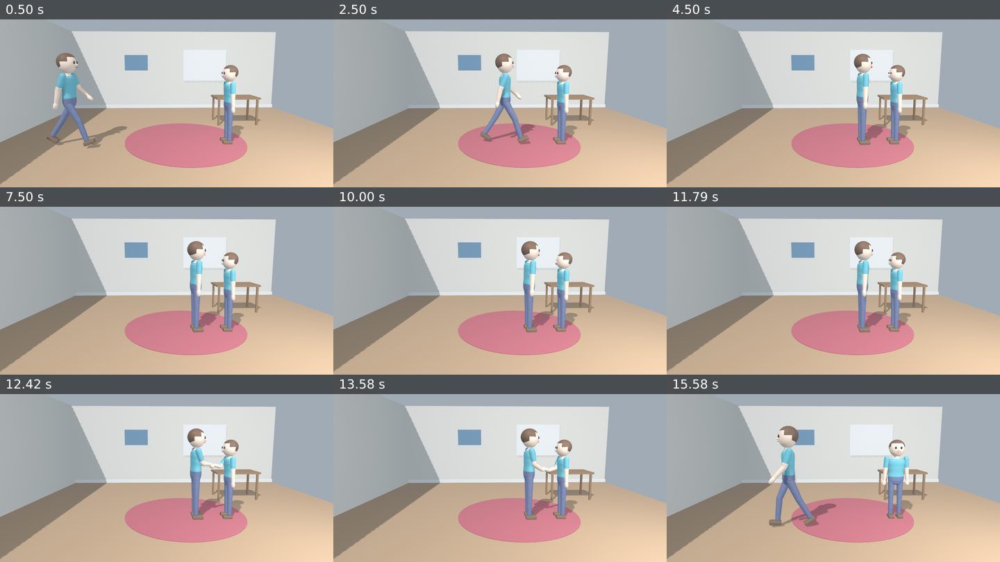
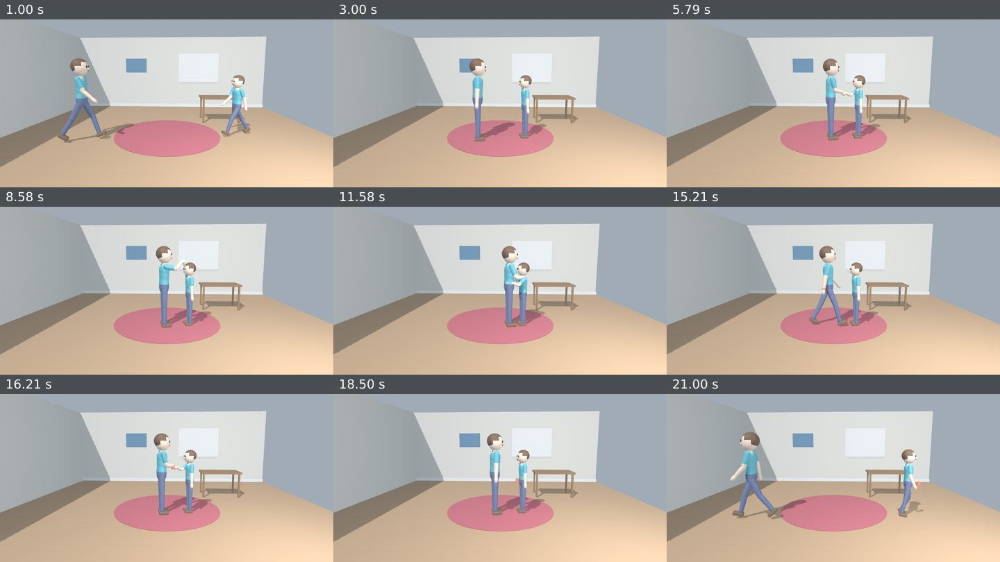
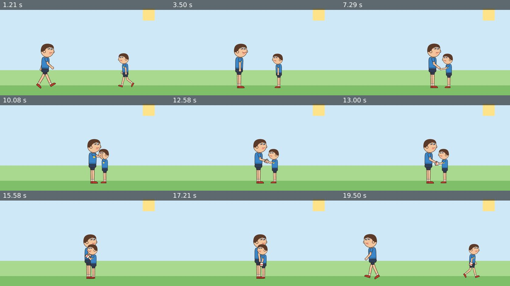

# Multi-character interactions: measured proof

Produced by `npx tsx examples/interactions-proof/run.ts`, which runs in about 27 minutes on a CPU; most of that is Blender rendering. Every scene is built only from high-level character actions and interactions: no keyframe is written by hand.

**Result: 40 of 40 checks passed.** Raw numbers are in `examples/interactions-proof/out/report.json`.

| Output | Content |
|---|---|
| [`conversation_3d.mp4`](../../examples/interactions-proof/out/conversation_3d.mp4) (16 s) | The required conversation scene |
| [`interactions_3d.mp4`](../../examples/interactions-proof/out/interactions_3d.mp4) (22 s) | Two 3D characters of different sizes: handshake, high five, hug, handing over a mug, separation |
| [`interactions_2d.mp4`](../../examples/interactions-proof/out/interactions_2d.mp4) (20 s) | The same interactions with two 2D characters of different sizes |

## 1. Conversation scene (3D, Mika and a smaller Mika at scale 0.88)

| Brief | Measured |
|---|---|
| 0–3 s: A walks to B | A arrives at x = 0.20 m, 0.70 m from B |
| 3–6 s: A talks and smiles, B blinks | Mouth-open max: A 0.70, B 0. Smile: A 1.0, B 0. B's blink morph reaches 1.0 |
| 6–9 s: B talks | Mouth-open max: A 0, B 0.85 |
| 9–11 s: both talk | A 0.85, B 0.70, at the same time. Each voice line is its speaker's own audio entry (a@3 s, a@9 s, b@6 s, b@9 s) |
| 11–14 s: handshake | Measured palm-to-palm distance (Blender): **0.4 mm** |
| 14–16 s: they separate | Distance grows from 0.70 m to 2.53 m |

## 2. Interactions between different sizes (3D, scale 1.0 and 0.8)

| Check | Measured |
|---|---|
| Independent movement | Both walk at the same time from opposite sides (0–2.2 s) |
| Talk and react | A talks while B shows surprise and blinks |
| Handshake | Palms meet within **0.4 mm** |
| High five | Hands meet within **0.6 mm** |
| Hug | Each hand is within **0.9 mm** of its target on the partner's back |
| Object transfer | The owner switches once, at frame 390: `a.mug` is hidden and `b.mug` shown on the same frame. The mug moves **1.9 mm** at the switch |
| Following the hand | Before the switch the mug is a constant 0.075 m from A's hand joint. Afterwards it is a constant 0.117 m from B's hand, while B walks away |
| Simultaneous faces | At 18.5 s, A smiles while B talks and smiles |
| Save / reload | A second workspace object recompiles the scene byte for byte, and the mug is at the same position |

## 3. The same in 2D (Pip at scale 1.1 and 0.85)

- Measured grip-to-grip distances from the rendered layout:
  - handshake: 0.15 px;
  - high five: 0.19 px;
  - handover: 0.13 px;
  - hug hands at the partner's back: 0.10 px.
- Transfer: the mug's corners move 0.17 px at the switch, and the owner changes exactly once.
- At the end the two characters walk apart.

## 4. Different sizes and limits

**3D handshake:** B (scale 1.0) and a partner of varying scale.

| Partner scale | Aligned distance | Contact height | Measured |
|---|---|---|---|
| 0.65 | 0.49 m | 0.96 m | 0.2 mm |
| 0.8 | 0.67 m | 1.02 m | 0.3 mm |
| 1.2 | 0.83 m | 1.24 m | 0.4 mm |

**2D:** Pip (scale 1.0) and a partner of varying scale.

| Interaction | Partner scale | Measured contact |
|---|---|---|
| handshake | 0.5 | 0.13 px |
| handshake | 0.75 | 0.17 px |
| handshake | 1.5 | 0.24 px |
| give_object | 0.6 | 0.14 px |
| high_five | 0.35 | **51.6 px short: reported** with `INTERACTION_OUT_OF_REACH`. It still renders, with the arm stretched toward the target |

**Limits:**

- Arms reach only as far as they are long. The runtime reports this; it does not fake it.
- Pip's arms are about 21% of its height, and its head is large. So the 2D high five happens at face height, and in a 2D hug the heads overlap.
- Only the arms are solved: no body lean, no collisions. In a hug the arms can pass slightly into the partner's mesh.
- In a push, the pushed character walks backward using its walk cycle.

See [`../INTERACTIONS.md`](../INTERACTIONS.md) for the design.
