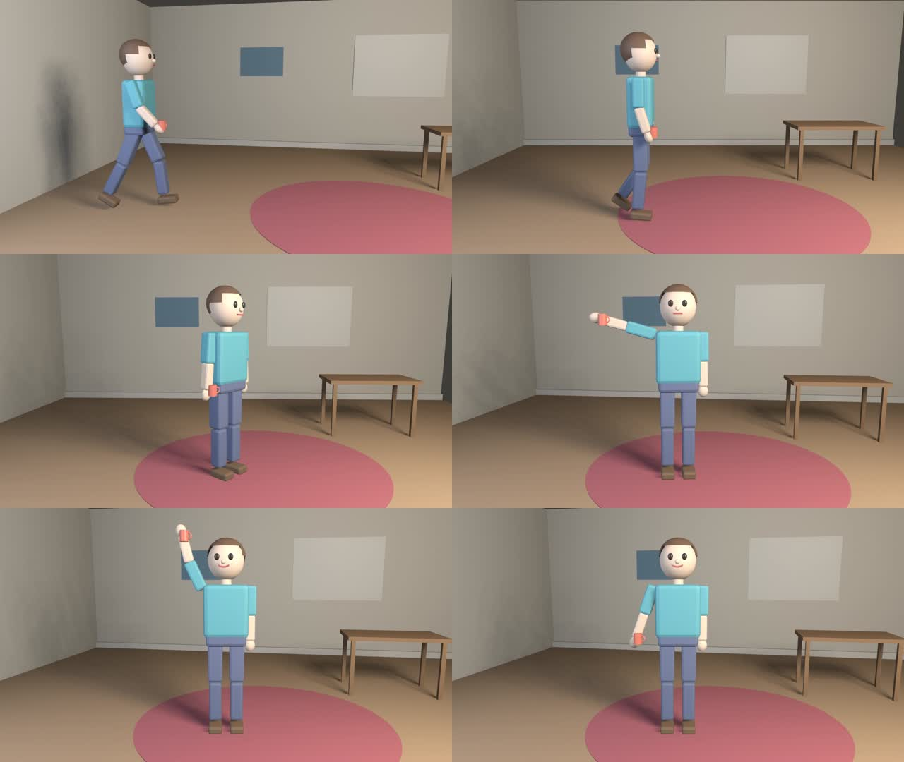

# Tandem × Video Engine MCP: 3D end-to-end run

A Tandem **Builder** agent (Claude Code CLI 2.1.282, spawned by Tandem) made a 4-second 3D
animation **only through the `video_engine_*` MCP tools**. Tandem served them through its
Integrations gateway, the same way as the 2D run in [`../tandem-e2e/REPORT.md`](../tandem-e2e/REPORT.md).
Nothing was prepared by hand: the agent started from an empty workspace and the read-only
`models` library (`assets/3d`).

Tandem's timeline for the run:

- **47 tool calls**, all `video_engine_*` MCP tools, **0 errors**;
- **0 shell commands** and **0 file edits**;
- **11 file reads**, all of them `viewPath` JPEGs returned by the tools (thumbnail, previews and debug previews).

Result: [`videos/clip3d_video_1.mp4`](videos/clip3d_video_1.mp4) (1280×720, 24 fps, 4.00 s, H.264).

## Setup

- **Tandem** (`mjrafg/tandem` v0.2.0) was restarted with the same container workarounds as the 2D run: `IS_SANDBOX=1`, and the outer session's environment variables removed.
- **Integration:** the existing Video Engine integration was updated with `integrations/tandem/register.mjs`. The engine was rebuilt (`npm run build:mcp`, which now ships `dist/blender/engine3d.py`), and `models=<repo>/assets/3d` was added to `VIDEO_ENGINE_LIBRARIES`. Output: `Connection test: OK — Connected — the server reports 40 tools.`
- **Blender:** 4.0.2 from apt, found on the `PATH` Tandem passes to the server. The agent's `engine_health` reported `healthy (2D + 3D)` and `renderer: eevee (EGL)`.
- **Prompt:** one plain-language message; the text is in [`tandem-chat-export.md`](tandem-chat-export.md). It gave the rules (only `video_engine_*` tools, look at `viewPath` images, no scripts, Blender or ffmpeg) and the task:
  - import the character, mug and room;
  - walk in from the left, stop and idle, turn to camera and wave, with the mug in the right hand;
  - smile near the end, with an animated camera;
  - check with measurements and previews, fix problems, render an MP4, report.

## What the agent did

| Step | MCP calls |
|---|---|
| Discover | `engine_capabilities` (read `threeD`), `engine_health` |
| Assets | `workspace_create`, `library_list`, `asset_import` ×3 (character, mug, room), `asset_inspect` (clips idle/walk/wave, sockets, morphs blink/mouth_open/smile/mouth_oh), Read of the thumbnail |
| Scene | `scene_create` (3D), `object_add` (room, hero, mug attached to `rightHand`, key and fill lights in one call), `scene_settings_3d` |
| Animation | `timeline_apply` ×2 batches: position/rotation keys, step `clip` track walk→idle→wave, `morph.smile`, `morph.blink`, camera dolly and `lookAt` tracking |
| Check | `measure_layout` ×10 (frames 0, 24, 70, 95, …), `render_preview` ×10 (2 debug), Read of each `viewPath` |
| Correct | `timeline_apply`, `object_update` ×4, `scene_settings_3d` ×2 |
| Render | `render_video_start`, `render_video_status` ×7 (long-poll, 45 s each); completed after 308 s (EEVEE, standard) |

### Corrections the agent made, and the evidence behind each

From its final report in the chat export:

1. **Feet cropped at the end.** `measure_layout` at frame 95 gave `fullyOnScreen: false`, `visibleFraction 0.99` and screen y 107→726 on a 720-pixel canvas. The agent softened the dolly (camera z 3.55→3.25 instead of 3.4→2.95) and fixed `lookAt.y` at 0.95. After that, frames 0, 24, 70 and 95 all measured `fullyOnScreen: true`.
2. **Entrance didn't read as "from the left".** Tracking kept the character dead-centre (screen centre x 580–624 at frames 0 and 24). The agent started `lookAt.x` further left, so the character's box sits at x 241–508 at frame 0.
3. **Wave not facing the camera.** The camera drifts to +x, which left the character about 11° off-axis. The agent ended `rotation.y` at 10° instead of 0°.
4. **Overexposure and mug placement**, both found from the frame-70 debug preview ([before](images/clip3d_f70_debug_1.view.jpg), [after](images/clip3d_f70_preview_4.view.jpg)) plus measurements:
   - **Lighting:** a 1200 W key light blew out the walls and the character. Key went to 260 W, fill 400→90 W, world strength 0.35→0.22.
   - **Mug:** with zero offset it sat exactly on the `hand.R` joint, inside the fist, and `follow:"full"` turned it upside-down during the wave (`rotation.z −170°`). The agent switched to `follow:"position"` with offset (0.02, −0.055, 0.06). It first probed the offset axes with two throwaway offsets and a `measure_layout` each.
   - **Verification:** the mug stayed within 6 cm of `hand.R` (the set offset) at frames 0, 14, 52, 70, 88 and 95.
5. **Background colour:** a cosmetic change to the world colour above the room walls.

## Feedback from the agent, and what changed because of it

| Agent feedback | Resolution |
|---|---|
| The `attach` offsets were documented as "in the bone's local frame", but they behave as offsets in the character's space. | That description was wrong: the implementation uses the target character's own axes at rest pose, anchored at the joint. `AttachSchema`'s description now says so, and explains `full` versus `position` and that a zero offset puts a held prop inside the hand. The same text is in `docs/3D.md`. |
| No guidance on light intensity for room scale ("100–2000 W" is too wide). | The intensity description now gives 50–300 W for a person-sized scene a few metres away, 1–4 for sun, and "blown-out white walls = too bright". |
| Foot slide: walk speed is not matched to the clip's stride. | Known and documented: clips play in place, root motion is not extracted, and speed is the author's choice (`clipSpeed` or the position keys). |
| `fullyOnScreen` / `visibleFraction` were the most useful signals ("the frame-95 foot crop was 6 px"). | — |

## Evidence in this folder

| File | What |
|---|---|
| `videos/clip3d_video_1.mp4` | The agent's final render |
| `images/contact_sheet.jpg` | Frames 2, 30, 52, 66, 80 and 94 of the MP4 |
| `images/*.view.jpg` | Every preview and debug preview the agent rendered and looked at, plus the character thumbnail |
| `scenes/clip3d.json` | The final scene document the agent built |
| `tool-calls.json` | Tandem's tool-call and file-read events: tool, status, duration |
| `mcp-server-log.jsonl` | The MCP server's own per-call log for workspace `studio3d` (calls without a workspace, such as `engine_health`, are not included) |
| `tandem-chat-export.md` | Tandem's full chat export: prompt, agent messages, tool rows |
