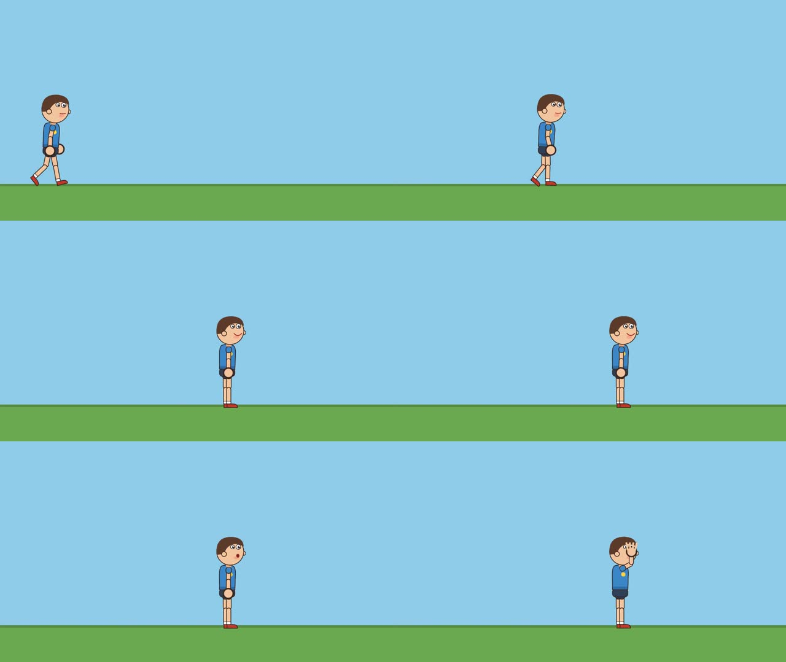

# Tandem × Video Engine MCP: character runtime end-to-end run

A Tandem **Builder** agent (Claude Code CLI 2.1.282, spawned by Tandem) produced a short
character video **using only high-level character actions over MCP**. It never authored a
keyframe for the character.

Tandem's timeline for the run:

- **21 tool calls**, all `video_engine_*` MCP tools, **0 errors**;
- **0 shell commands** and **0 file edits**;
- **4 file reads**, all of them the `viewPath` previews the tools returned.

Result: [`videos/pip_intro_video_1.mp4`](videos/pip_intro_video_1.mp4) (1280×720, 24 fps, 8.0 s; rendered in 2.8 s).

## Setup

- **Tandem:** as in the earlier runs (`IS_SANDBOX=1`, the outer session's environment variables removed). The engine was rebuilt with `npm run build:mcp`.
- **Integration:** re-registered with `integrations/tandem/register.mjs` with `characters=<repo>/assets/characters` added to `VIDEO_ENGINE_LIBRARIES`. Output: `Connection test: OK — Connected — the server reports 49 tools.`
- **Prompt:** one plain-language message; the full text is in [`tandem-chat-export.md`](tandem-chat-export.md).
  - **Rules:** only `video_engine_*` tools; no keyframes for the character (no `timeline_apply` or `layer_update` on it); say what, when, how long and where.
  - **Task:**
    - find and prepare Pip, inspect it, and place it in a 2D scene with a background;
    - walk right for 3 s, then talk with a saved speech timing while smiling, blinking during the speech;
    - preview and look, then inspect and adjust;
    - render an MP4 and report.

## What the agent did

| Step | MCP calls |
|---|---|
| 1. Find + prepare | `library_list` ×2, `workspace_create`, `character_list {library}` (→ packages pip 2D, mika 3D), `character_import {pip}` |
| 2. Capabilities | `character_inspect {pip}` |
| 3. Scene | `scene_create` (2D, 1280×720 @ 24 fps, 8 s), `layer_add` (static ground strip), `character_add {pip1, x:220, y:612}` |
| 4–6. Walk / talk + smile / blink | `speech_timing_save {pip_hello}` (8 word timings, "Hi! I am Pip. Nice to meet you!"), then **one** `character_actions` batch: walk right 3 s, talk (speech `pip_hello`), smile, blink ×3 |
| 7. Look | `render_preview` at frame 120, plus the same with `debug`, each opened with Read |
| 8. Inspect + adjust | `measure_layout`, `character_timeline`, `character_update` (start x, autoBlink), a second `character_actions` batch (add a wave, extend the smile), two more previews opened with Read |
| 9. Render | `render_video_start`, `render_video_status {waitSeconds: 45}` → completed |

**Actions versus generated keyframes**, as the agent read them from `character_timeline`:

| Stage | Actions | Tracks | Keyframes |
|---|---|---|---|
| Placement only (auto-blink, idle) | 0 | 6 | 114 |
| + walk, talk, smile, blink | 4 | 18 | 876 |
| + wave (final) | 5 | 19 | 913 |

**5 high-level actions → 913 keyframes on 19 tracks**, all generated by the engine.

### Adjustments, and the evidence behind each (from the agent's report)

1. **Start x 220 → 140.** `measure_layout` at frame 120 put the root at x = 820 and the head at 775–879: Pip ended in the right third of the frame. The walk is 3 s × 200 px/s = 600 px, so the agent moved the start to 140 to land near the centre (740), keeping the walk unchanged.
2. **Background blinking reseeded** (`autoBlink {interval: 3.6, seed: 11}`). The first preview caught Pip with his eyes shut. `character_timeline` showed an auto blink 0.17 s after a scheduled one. After reseeding, the re-render showed his eyes open.
3. **A wave added (6.9–7.9 s) and the smile extended.** The talk resolved to 3.71–6.79 s, leaving the last 1.2 s empty. The frame-176 preview confirmed the raised arm with the smile held.

## Feedback from the agent, and what changed because of it

| Feedback | Resolution |
|---|---|
| Background blinks can land right next to scheduled blinks (a double blink), and the blink list does not say which is which. | **Engine rule added:** automatic blinks keep at least 1 s away from scheduled blinks. `character_timeline` now labels each blink `autoBlink` or `action <id>`. A regression test covers both. |
| Unclear whether walk speed scales with the character `scale`. | It does: default speed × instance scale. This is now stated in `character_inspect` (`speedUnit`), in the resolved walk (`speedUnit` next to the effective `speed`) and in `docs/CHARACTERS.md`. |
| `character_timeline` lists actions by start time, not insertion order. | Documented in the response (`note`) and in the docs. |
| The agent suggested checking foot slide during the walk and the walk→idle hand-off. | Foot slide is a known limit of in-place cycles on a constant-speed path; it is in the docs' limits. The walk→idle transition blends over 0.2 s. |

**Art note:** Pip is a pure side-view rig, so the near-arm wave crosses the face in profile, as frame 180 of the contact sheet shows. This is a property of the simple test artwork, not of the runtime. A production character package would ship its own wave preset.

## Evidence in this folder

| File | What |
|---|---|
| `videos/pip_intro_video_1.mp4` | The agent's final video |
| `images/contact_sheet.jpg` | Frames 10, 50, 100, 125, 160 and 180 of the MP4 |
| `images/*.view.jpg` | The previews and debug preview the agent rendered and looked at |
| `scenes/pip_intro.json` | The final scene document: the `characters[0].actions` high-level state plus the generated, owned tracks |
| `scenes/speech_pip_hello.json` | The speech timing the agent saved |
| `tool-calls.json` | Tandem's tool-call and file-read events |
| `mcp-server-log.jsonl` | The MCP server's per-call log for workspace `cast-e2e` |
| `tandem-chat-export.md` | Tandem's full chat export: prompt, agent messages, tool rows |
